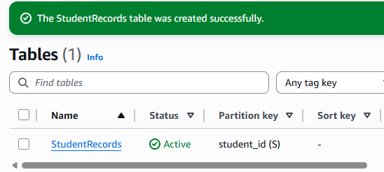
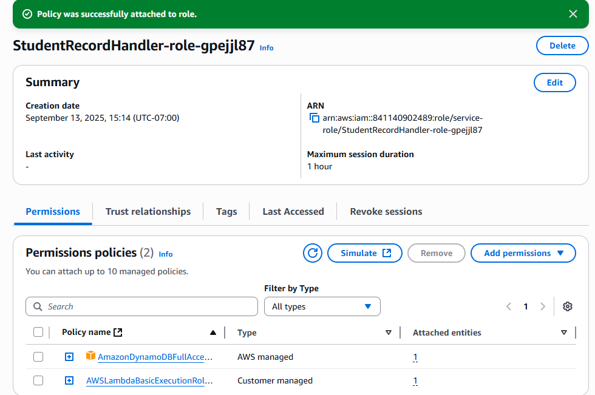
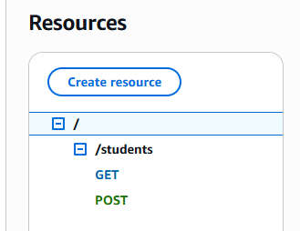

# CMPE272-01-A1
Irwin Salamanca CMPE 272 Assignment 2

The purpose of this repository is to showcase the build of a servless web application with AWS Lambda and DynamoDB.

**Building the Serverless Web Application**
1. Create a table called StudentRecords with the partition key being student_id in DynamoDB through AWS Management Console.
   
   
2. Create an AWS Lambda Function in AWS Lambda through AWS Management Console and give Lambda function permission to be able to read/write to DynamoDB. The code used for the lambda function can be found [here](./lambda_function.py). The code is based on example code provided by the professor in the assignment word document. Below is a screenshot showing that the Lambda function was given permission to be able to read/wrte to DynamoDB.
   
   
3. Create an Rest API named StudentAPI in API Gateway through AWS Management Console. Setup POST and GET methods and then deploy the API.
   
   

_***Note**: Here is the invoke URL used to test the application: https://htgh6xl2aa.execute-api.us-east-2.amazonaws.com/tester*_

4. Test the application - mainly the create and read operations. Curl was used to test the API by sending HTTP requests to the deployed API Gateway. Below are the requests used to test the create and read operation.

<u>create</u>
curl -X POST \
  https://htgh6xl2aa.execute-api.us-east-2.amazonaws.com/tester/students \
  -H "Content-Type: application/json" \
  -d '{"student_id":"123","name":"John Doe","course":"Enterprise Software"}'

<u>read</u>
Below is a screenshot of utilizing these two requests using curl and the results from using both. 

   

**Optional**
The Lambda function was extended to be able to handle PUT and DELETE.

**Reflection**

I faced a couple challenges. 

From using AWS Lambda and DynamoDB I learned many things. I learned how to trigger a Lambda function using an API Gateway, interact with DynamoDB to perform basic CRUD operatinos, and how to deploy and test this application in the AWS environment. I also learned that both services are loosely coupled as they both function independently from each other while being able to communicate with each other. 

