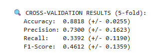

# CMPE272-01-A3
Eugene Lacatis, Atharva Prasanna Mokashi, Irwin Salamanca, Matthew Tang
CMPE 272 Assignment 3

The purpose of this repository is to showcase a classification model ***(Decision Tree)*** implemented to predict customer churn. The Jupyter Notebook along with a short report are provided in this project directory. 

<mark>***Before starting the program be sure to have your Kaggle API token in the working folder where the Jupyter Notebook is. Instructions on how to get your Kaggle API token is [***here***](https://www.kaggle.com/docs/api).***</mark>

The two datasets used in this model are below:
[***Telco Customer Churn Dataset***](https://www.kaggle.com/datasets/blastchar/telco-customer-churn)
[***Customer Personality Analysis Dataset***]([https://www.kaggle.com/datasets/blastchar/telco-customer-churn](https://www.kaggle.com/datasets/imakash3011/customer-personality-analysis))

Below are screenshots of the results using the datasets 

**Telco Customer Churn**
-a

-a

-a

**Customer Personality Analysis**
-a

-a

-a

